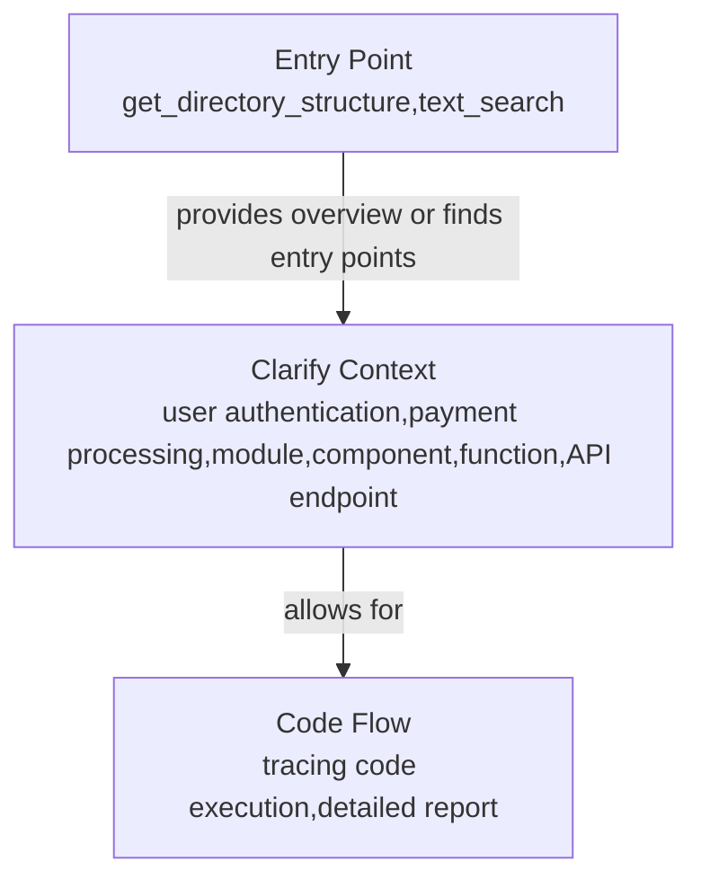

# Codebase Research Report

## Query
find the flow of the code

## Answer
### System Diagram

### Summary
To understand the flow of the code, I need a more specific starting point or context. Could you please clarify what flow you're interested in? For example:

*   The flow of a specific feature (e.g., user authentication, payment processing).
*   The flow related to a particular module or component.
*   The flow initiated by a specific function or API endpoint.

Once you provide more details, I can use the available tools to trace the code execution and provide a report.

In the meantime, if you're unsure where to start, I can use `get_directory_structure` to give you an overview of the codebase structure, or `text_search` to find potential entry points based on keywords.

## Walkthrough Steps

### 1. Clarify the Desired Code Flow
To trace the flow of code, a specific starting point or context is needed. The user should clarify the desired flow, such as a specific feature like user authentication or payment processing, a particular module or component, or a specific function or API endpoint. Providing more details will allow for tracing code execution and providing a detailed report.

### 2. Identify Potential Entry Points
If the user is unsure where to start, the `get_directory_structure` tool can provide an overview of the codebase structure. Alternatively, the `text_search` tool can be used to find potential entry points based on keywords. These tools can help identify the starting point for tracing the code flow.

---
*Generated by [CodeViz.ai](https://codeviz.ai) on 6/14/2025, 7:03:27 PM*
